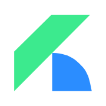
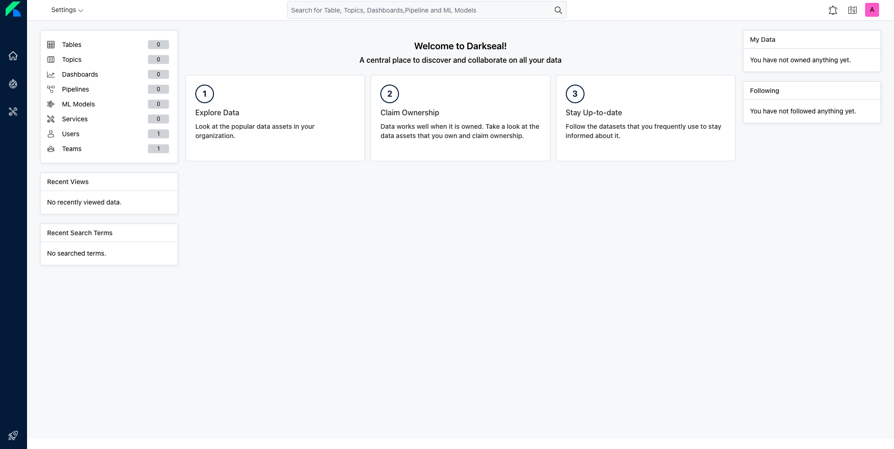
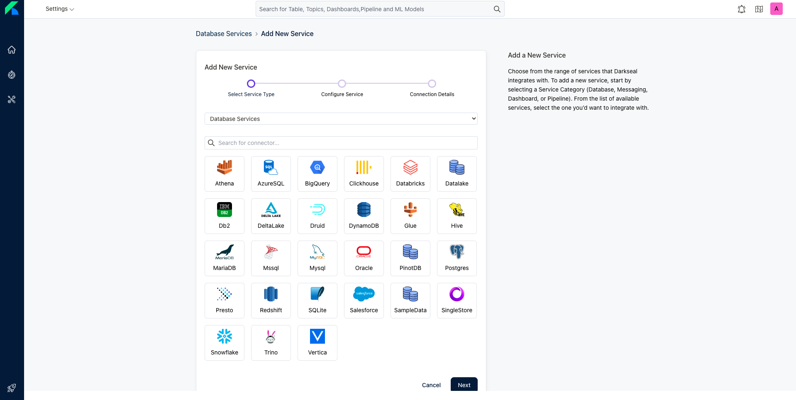
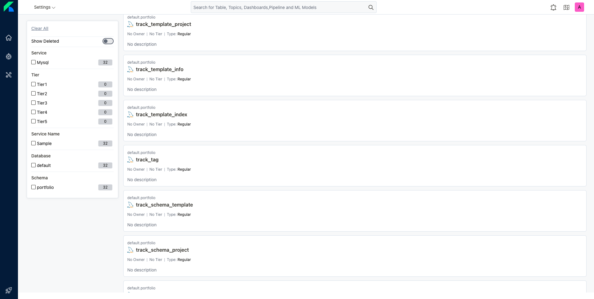
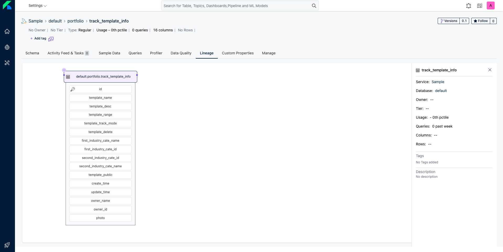
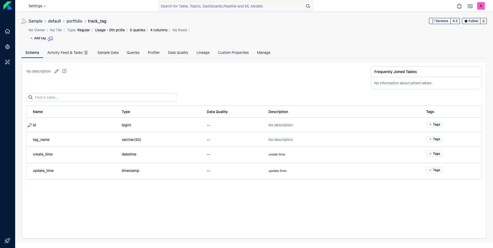
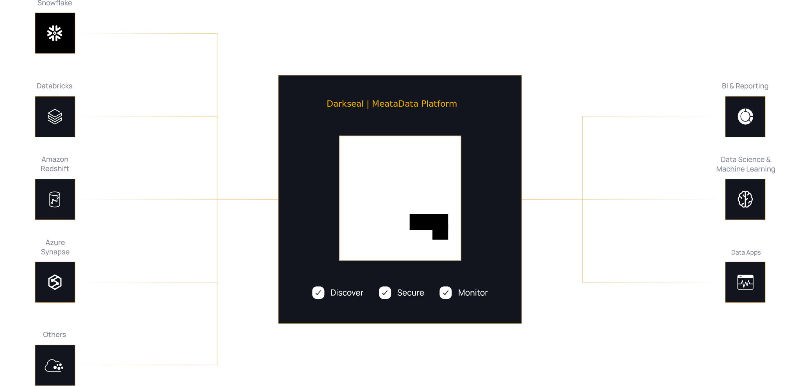

    
     

    
     
    <small>A Single place to Discover, Collaborate, and Get your data right</small>

# Darkseal

Darkseal includes the following:

- **Metadata schemas** - Defines core abstractions and vocabulary for metadata with schemas for Types, Entities, Relationships between entities. This is the foundation of the Open Metadata Standard.
- **Metadata store** - Stores metadata graph that connects data assets, user, and tool generated metadata.
- **Metadata APIs** - For producing and consuming metadata built on schemas for User Interfaces and Integration of tools, systems, and services.
- **Ingestion framework** - A pluggable framework for integrating tools and ingesting metadata to the metadata store. Ingestion framework already supports well know data warehouses - Google BigQuery, Snowflake, Amazon Redshift, and Apache Hive, and databases - MySQL, Postgres, Oracle, MSSQL, and [Guinsoo](https://github.com/ciusji/guinsoo).
- **Metadata User Interface** - One single place for users to discover, and collaborate on all data.

## Snapshots & Gifs

### Welcome

### New Service

### Explore Tables

### Table Lineage

### Table Schema

## Architecture

Darkseal depends on following components to build a metadata platform:

- JsonSchemas for defining Metadata Schemas
- Dropwizard/Jetty for REST APIs
- MySQL 8.x to store Metadata ([Guinsoo](https://github.com/ciusji/guinsoo) is coming)
- ElasticSearch/OpenElasticsearch 7.x to index Metadata and power

## Documentation & Supports

- [Overview](https://ciusji.gitbook.io/guinsoolab/products/data-discovery/darkseal/overview)
- [Install & Deploy](https://ciusji.gitbook.io/guinsoolab/products/data-discovery/darkseal/deployment)
- [Quickstart With Darkseal](https://ciusji.gitbook.io/guinsoolab/products/data-discovery/darkseal/quickstart)
- [Darkseal Main Concepts](https://ciusji.gitbook.io/guinsoolab/products/data-discovery/darkseal/main-concepts)
- [Dearkseal Integrates in GuinsooLab or Bigdata Platform](https://ciusji.gitbook.io/guinsoolab/products/data-discovery/darkseal/integrations)
- [Roadmap](https://ciusji.gitbook.io/guinsoolab/products/data-discovery/darkseal/roadmap)

## Contributors

We ❤️ all contributions, big and small! Check out our [CONTRIBUTING](./CONTRIBUTING.md) guide to get started and let us know how we can help.

Don't want to miss anything? Give the project a ⭐ 🚀

## License

Darkseal is released under [Apache License, Version 2.0](http://www.apache.org/licenses/LICENSE-2.0)
