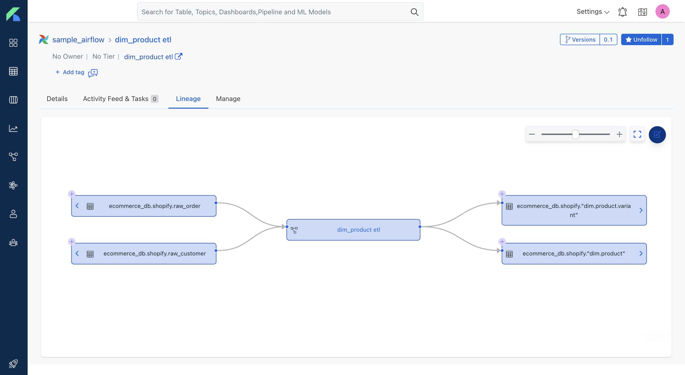

<div align="right">
    
    <br />
</div>
<div align="center">
    
    <br />
    <br />
</div>

# Darkseal

Unlock the value of data assets with an end-to-end metadata platform that includes data discovery, governance, data quality, observability, and people collaboration.

## Quickstart

```bash
wget https://raw.githubusercontent.com/GuinsooLab/darkseal/master/docker-compose.yml
docker-compose up -d
```

For more information, please referer to [here](https://ciusji.gitbook.io/darkseal/).

## Main Features

- Data Trust
- Data Documentation
- Data Governance
- Discovery & Collaboration
- Teams & Users with Roles and Policies
- Data Glossaries
- Data Insights
- Data Lineage
- Security & Compliance
- Alerts & Notifications

## Core Components

Darkseal includes the following:

- **Metadata schemas** - Defines core abstractions and vocabulary for metadata with schemas for Types, Entities, Relationships between entities. This is the foundation of the Open Metadata Standard.
- **Metadata store** - Stores metadata graph that connects data assets, user, and tool generated metadata.
- **Metadata APIs** - For producing and consuming metadata built on schemas for User Interfaces and Integration of tools, systems, and services.
- **Ingestion framework** - A pluggable framework for integrating tools and ingesting metadata to the metadata store. Ingestion framework already supports well know data warehouses - Google BigQuery, Snowflake, Amazon Redshift, and Apache Hive, and databases - MySQL, Postgres, Oracle, MSSQL, and [Guinsoo](https://github.com/ciusji/guinsoo).
- **Metadata User Interface** - One single place for users to discover, and collaborate on all data.

## Snapshot & Gifs

### Database Service


### Workflow DAG



### Data Tables


### Table Columns


### Stream Lineage


## Documentation & Supports

- [Introduction 😋](https://ciusji.gitbook.io/darkseal/)
- Overview
  - [Tutorial](https://ciusji.gitbook.io/darkseal/overview/tutorial)
  - [Features](https://ciusji.gitbook.io/darkseal/overview/features)
  - [Releases](https://ciusji.gitbook.io/darkseal/overview/releases)
  - [Roadmap](https://ciusji.gitbook.io/darkseal/overview/roadmap)
- Deployment
  - [Docker Deployment](https://ciusji.gitbook.io/darkseal/deployment/docker-deployment)
  - [Bare Metal Deployment](https://ciusji.gitbook.io/darkseal/deployment/bare-metal-deployment)
- Service Integrations
  - [Database](https://ciusji.gitbook.io/darkseal/connectors/database)
  - [Dashboard](https://ciusji.gitbook.io/darkseal/connectors/dashboard)
  - [Messaging](https://ciusji.gitbook.io/darkseal/connectors/messaging)
  - [Pipeline](https://ciusji.gitbook.io/darkseal/connectors/pipeline)
  - [ML Model](https://ciusji.gitbook.io/darkseal/connectors/ml-model)
  - [Metadata](https://ciusji.gitbook.io/darkseal/connectors/metadata)
  - [Ingestion](https://ciusji.gitbook.io/darkseal/connectors/ingestion)
- Developers
  - [Architecture](https://ciusji.gitbook.io/darkseal/developers/architecture)
  - [Contribute](https://ciusji.gitbook.io/darkseal/developers/contribute)
  - [Web Hooks](https://ciusji.gitbook.io/darkseal/developers/web-hooks)
- Appendix
  - [FAQs](https://ciusji.gitbook.io/darkseal/appendix/faq)
  
## Contributors

We ❤️ all contributions, big and small! Check out our [CONTRIBUTING](./CONTRIBUTING.md) guide to get started and let us know how we can help.

Don't want to miss anything? Give the project a ⭐ 🚀

## License

Darkseal is released under [Apache License, Version 2.0](http://www.apache.org/licenses/LICENSE-2.0)


