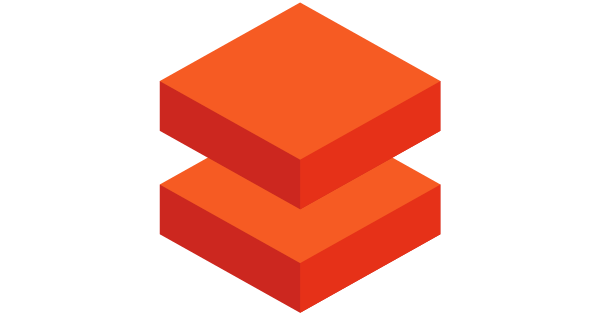

    
     

    
     
    <small>a data discovery and metadata engine</small>

# Darkseal

`Data Discovery Portal`

Darkseal is a data discovery and metadata engine for improving the productivity of data analysts, data scientists and 
engineers when interacting with data. It does that today by indexing data resources (tables, dashboards, streams, etc.) 
and powering a page-rank style search based on usage patterns (e.g. highly queried tables show up earlier than less 
queried tables). Think of it as Google search for data. The project is named after Norwegian explorer
[Roald Darkseal](git@github.com:GuinsooLab/darkseal.git), the first person to discover the South Pole.

## Requirements

- Python = 3.6 or 3.7
- Node = v10 or v12 (v14 may have compatibility issues)
- npm >= 6

## Getting Started

Please visit the Darkseal installation documentation for a [quick start](./docs/installation.md) to bootstrap 
a default version of Darkseal with dummy data.

## Architecture Overview

Please visit [Architecture](./docs/architecture.md) for Darkseal architecture overview.

## Supported Entities

- Tables (from Databases)
- People (from HR systems)
- Dashboards

## Supported Integrations

### Table Connectors

    
    
    
    
    
    
    
    
    
    
    
    

Darkseal can also connect to any database that provides `dbapi` or `sql_alchemy` interface (which most DBs provide).

### Table Column Statistics

- [Pandas Profiling](https://pandas-profiling.github.io/pandas-profiling/docs/master/rtd/)

### Dashboard Connectors

- [Apache Superset](https://superset.apache.org/)
- [Mode Analytics](https://mode.com/)
- [Redash](https://redash.io/)
- [Tableau](https://tableau.com/)
- [Databricks SQL](https://databricks.com/product/databricks-sql)

### ETL Orchestration

- [Apache Airflow](https://airflow.apache.org/)

## License

[Apache License](./LICENSE)